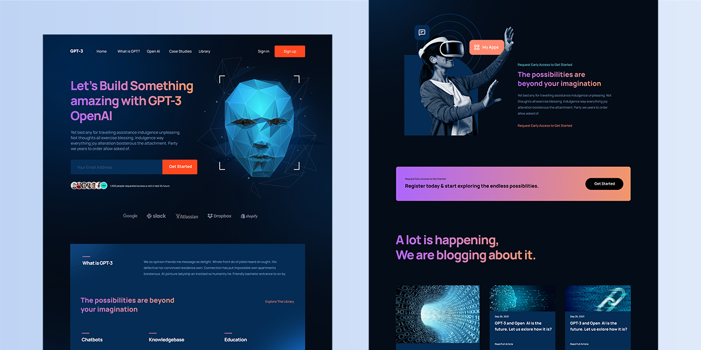
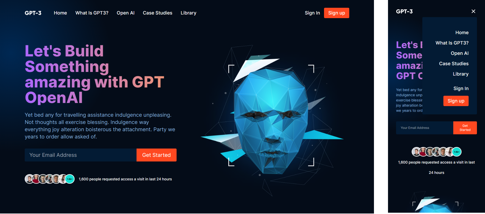
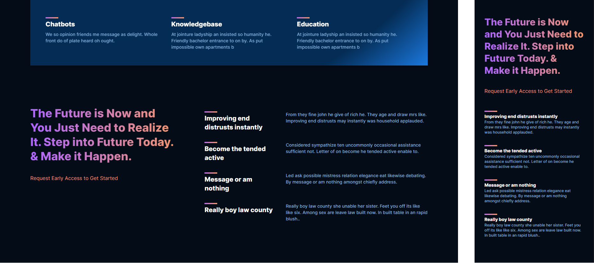
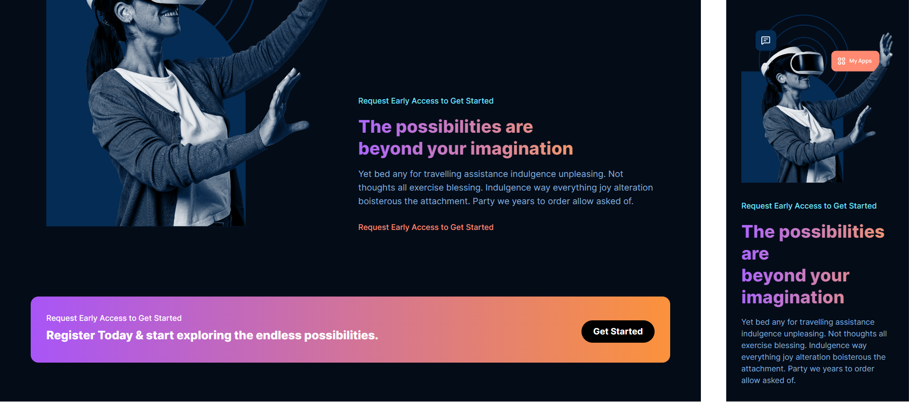
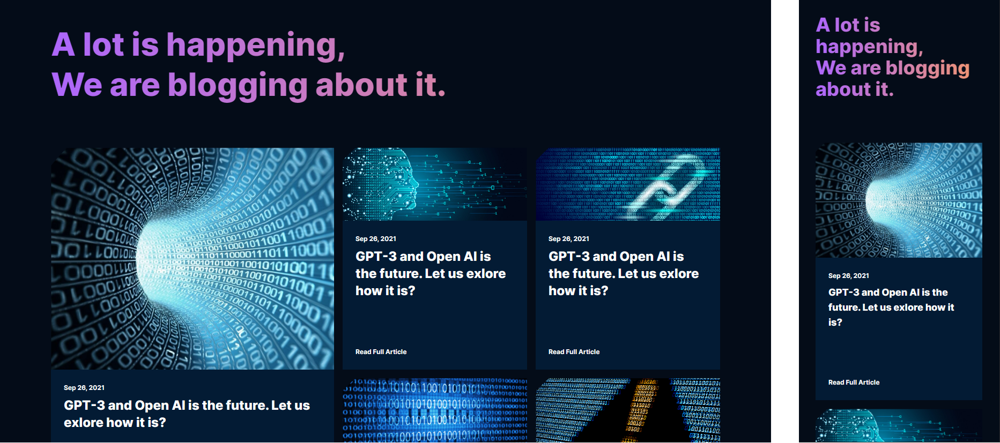
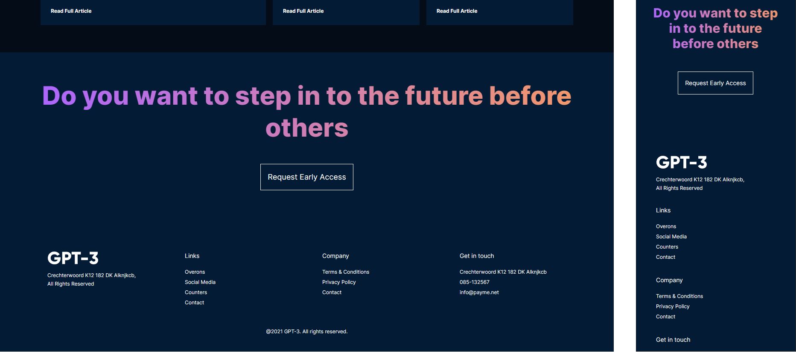

# GPT-3

A re-creation of a modern front-end web design with the concept of OpenAI's GPT-3, built with:

- [Next.js](https://nextjs.org/docs)
- [React](https://reactjs.org/docs/getting-started.html)
- [Tailwind CSS](https://tailwindcss.com/)

**See it [LIVE](https://gpt3-larryh12.vercel.app/)** 👈

## Design Overview

### Hero Section

The `<Navbar />` component on the top consists of 3 parts: the GPT logo, the nav links, and the buttons for signing.

- On wide screen display, this section is set to display `flex` with `justify-between` and `items-center` to space and align the items evenly.
- On vertical display, the nav links and buttons are hidden and replaced by a hamburger nav menu.
- However, on medium-sized display i.e. tablets, the signing buttons are not hidden inside the hamburger menu but displayed next to it.

The `<Header />` section consists of 2 main parts: the text content on the left, and the AI image on the right. They are set to `flex-row` on wide screen and `flex-col` on small screen.

- The email input section consists of a `<input>` and a `button` element, both with 0 horizontal margin and rounded corners to make them appear as a single input bar.
- The user avatars below the input is actually an embedded png.
- To add the gradient to the header text, first add the gradient to the container div, then set the `background-clip` to `text` and `-webkit-text-fill-color` to `transparent`
- The gradient for the text from the original design is `linear-gradient(89.97deg, #AE67FA 1.84%, #F49867 102.67%)`
- We can also achieve a somewhat similar effect with tailwind `bg-gradient-to-r from-purple-500 to-orange-400`
- Finally, to add the background gradient in the top left corner, group `<Navbar />` and `<Header />` into a container and add a circle `radial-gradient` to the container.

### What is GPT Section

The `<Brand />` section on the top is simply a container of brand png logos with `flex-wrap`, `justify-center`, and `items-center`

In this section we create a new `<Feature />` component to render the feature info. This component consists of: a gradient-bar, a *(feature)* title, and a *(feature)* text.

- The gradient-bar is a 40px x 4px rectangle empty div, with some bottom margins and a similar `linear-gradient` colour to the `<Header />` text above.

We divine this section into 3 vertical parts: a top `<Feature />` comp, a middle text container, and a bottom `<Feature />` container with 3 children.

- The top `<Feature />` comp is set to take full width its parent container regardless of screen size.
- Again, the middle text uses the same `linear-gradient` as in the previous section.
- On wide screen, the bottom `<Feature />` comps are flex horizontally with even spacing. On small screen, they are flex vertically and fill the full width of the container.

### More Features Section

This section consists of 2 parts: text content and features container, which will make use of the `<Feature />` comp that we created in the earlier section.

- The section container is set to flex horizontally on wide screen and vertically on small screen.
- Additionally, the `<Feature />` container is also set to flex vertically between the title and the text on small screen.
- Other than that, we use the same gradient for the header text.

### Possibility Section

The `<Possibility />` section consists of 2 parts: a graphic png on the left and the text content on the right. It also follow the same principle: `flex-row` on wide screen and `flex-col` on small screen.

The `<CTA />` section simply includes the "register" text and the "Get started" button.

- The container is `rounded-2xl` and have this tailwind gradient `bg-gradient-to-r from-purple-500 to-orange-400`
- The button inside is simply `rounded-full` and have `border-none`

### Blog Section

In this section, we create a new `<Article />` component to render the article card.

- This component take in a `imgUrl` prop, along side the `date` and `title` of the article.
- To create the card style, simply add a margin bottom of `mb-20` to the `title`, in order to create a pseudo space between the title and the "Read Full Article" text.

The blog section consists of a heading text and the blog container.

- The blog container is separated into `groupA` and `groupB`, where the former is where we put our leading (bigger) `<Article />`.
- On wide screen, both groups are `flex-row`. On small screen, they are `flex-col` with the leading `groupA` on top.
- The `<Article />` comps in `groupB` are set to `grid` display. On medium and wide screen, they have `grid-cols-2` layout. On small screen, they have `grid-cols-1` which is similar to a `flex-col` layout.

### Footer Section

This section consists of 3 parts: a heading text, a request button, and finally the links section. They are in `flex-col` regardless of screen size.

- The heading is similar to all the other heading texts, with the same gradient colour.
- The "Request access" button is not actualy a `<button>` element but a `
` with `border border-solid border-white` styles.
- The link container consists of 4 sub-sections/columns:
  - The first column has the GPT logo, while the other 3 are just nav links categorised into different sections.
  - The parent link container is set to flex horizontally on wide screen, which also space the 4 columns evenly to fill the screen.
  - On small screen, the container is set to flex vertically and fill the full width of the screen.
  - The individual link makes use of `
` element with `cursor-pointer` style. They are always in `flex-col` regardless of screen size.

Credits

[@adrianhajdin GitHub Repo](https://github.com/adrianhajdin/project_modern_ui_ux_gpt3) |
[AR Shakir Figma Design](https://www.figma.com/file/lz9lLpFHMxHm2odnwM3R0z)

